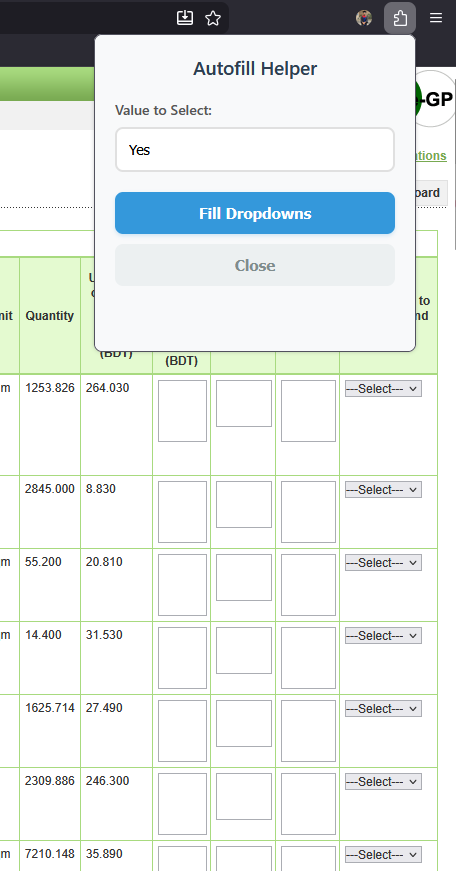
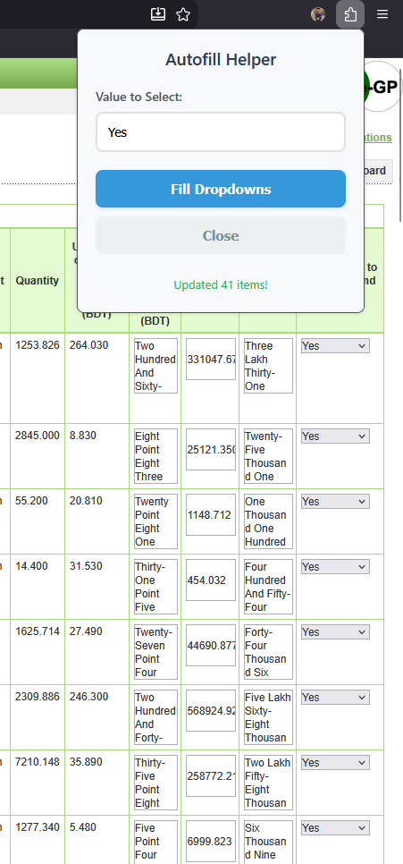
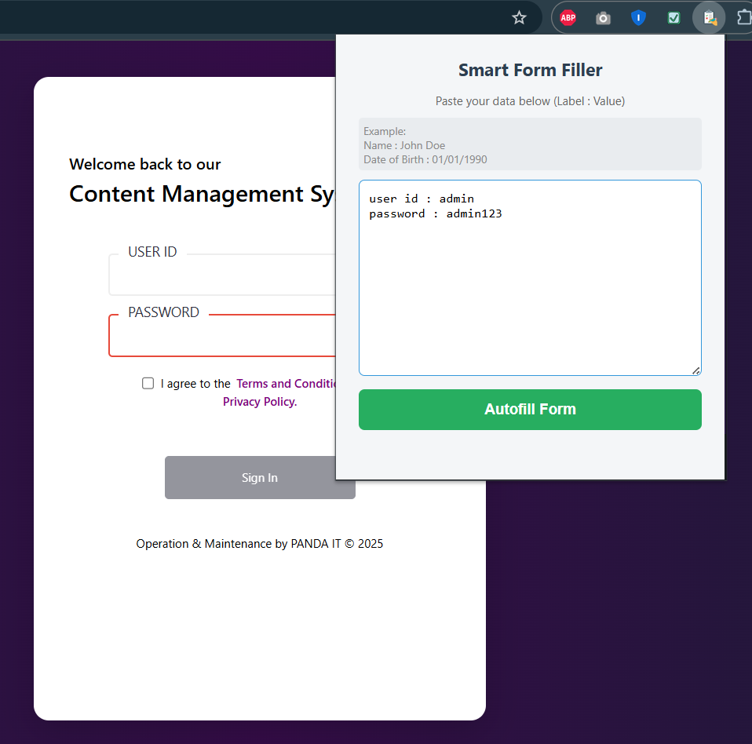
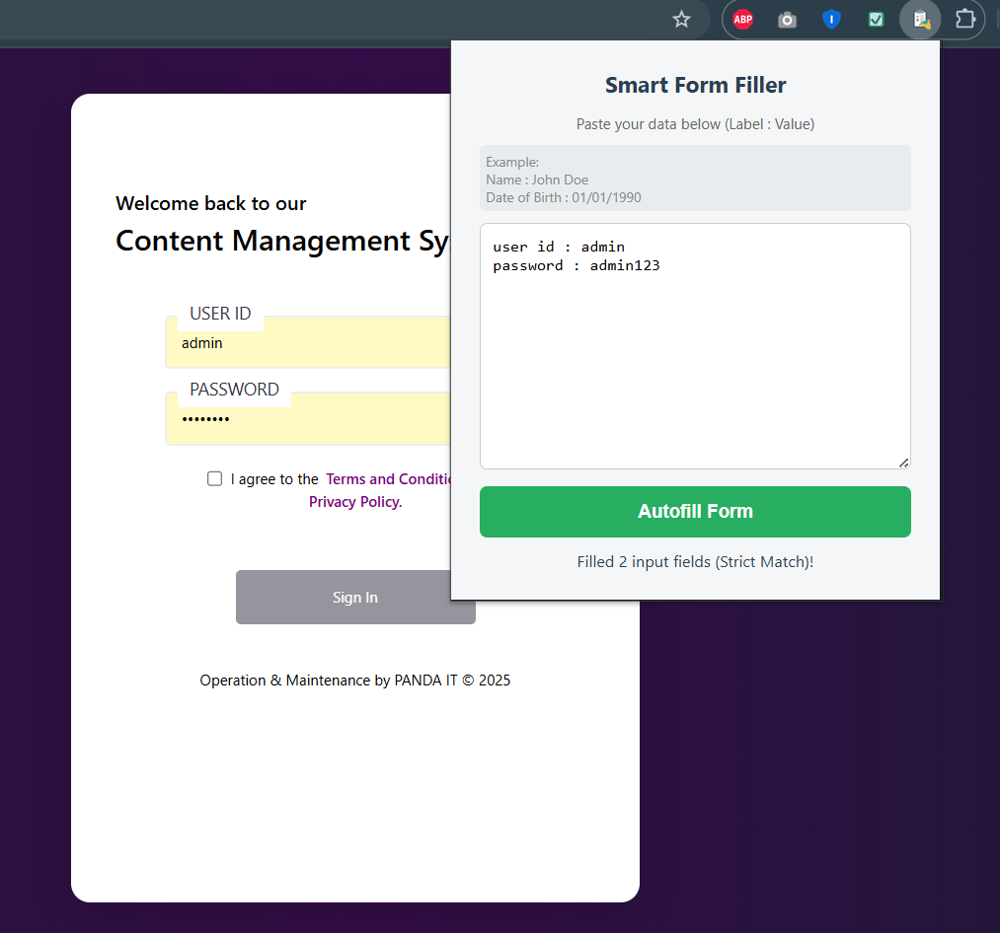

# ⚡ Form Automation Tools

A collection of powerful browser extensions designed to automate
repetitive data entry on complex web forms. This repository includes two
specialized tools optimized for different automation needs.

## 📂 Included Extensions

| Extension               | Purpose                           | Best For |
|-------------------------|-----------------------------------|----------|
| **Dropdown Autofiller** | Bulk update of dropdown (`<select>`) fields | Forms requiring repetitive selections (e.g., 50+ rows set to "Yes") |
| **Smart Form Filler**   | Intelligent text field autofill using label/value mapping | Complex forms, government tenders, table-based layouts |

## 🛠 Extension 1: Dropdown Autofiller

A lightweight utility that instantly updates all dropdown elements on a
page to a specified value.

### ✨ Features

-   **Bulk Update:** Modify hundreds of dropdowns in milliseconds.
-   **Case-Insensitive Matching:** "yes", "Yes", "YES" --- all match.
-   **Event Triggering:** Fires `change` events so dynamic calculations
    refresh automatically.

### 🚀 Usage

1.  Click the extension icon.
2.  Enter the value you want to select (e.g., `Yes`, `No`, `N/A`).
3.  Click **Fill Dropdowns**.

### 📸 Screenshots

## 🧠 Extension 2: Smart Form Filler

An advanced automation tool that maps human-readable text to form fields
using intelligent label detection --- ideal for large, table-heavy
systems.

### ✨ Features

-   **Plain Text Mapping:**\
    Use a simple `Label : Value` format, e.g.:

        Name : John Doe
        Date of Birth : 01/01/1990
        National ID : 123456789
        Position : Manager

-   **Smart Table Detection:** Finds labels even when they're in
    separate table cells.

-   **Strict Matching:** Prevents wrong matches (e.g., `"Position"`
    won't overwrite `"Proposed Position"`).

-   **Local Storage:** Saves your input between sessions.

-   **Safe Execution:** Ignores hidden fields to prevent accidental
    changes.

### 🚀 Usage

1.  Click the extension icon.
2.  Paste your label-value data.
3.  Click **Autofill Form** --- the script scans and fills all matching
    fields.

### 📸 Screenshots

## 🧩 Installation Guide

Install these extensions manually (no store required).

### Chrome / Edge / Brave

1.  Download or clone this repository.
2.  Open `chrome://extensions`.
3.  Enable **Developer Mode**.
4.  Click **Load Unpacked**.
5.  Select the extension folder (e.g., `smart-form-filler`).

### Firefox

1.  Open `about:debugging#/runtime/this-firefox`.
2.  Click **Load Temporary Add-on...**
3.  Select the extension's `manifest.json`.

## 🔒 Privacy & Permissions

-   **Storage:** Only used to save your input locally.
-   **ActiveTab & Scripting:** Required to inject autofill logic into
    the open page.
-   **Offline:** No data is transmitted or stored externally.
-   **No Tracking:** 100% client-side, safe for sensitive environments.

## 📄 License

MIT License

Copyright (c) 2025 Shahrear Rahman

Permission is hereby granted, free of charge, to any person obtaining a copy
of this software and associated documentation files (the "Software"), to deal
in the Software without restriction, including without limitation the rights
to use, copy, modify, merge, publish, distribute, sublicense, and/or sell
copies of the Software, and to permit persons to whom the Software is
furnished to do so, subject to the following conditions:

The above copyright notice and this permission notice shall be included in all
copies or substantial portions of the Software.

THE SOFTWARE IS PROVIDED "AS IS", WITHOUT WARRANTY OF ANY KIND, EXPRESS OR
IMPLIED, INCLUDING BUT NOT LIMITED TO THE WARRANTIES OF MERCHANTABILITY,
FITNESS FOR A PARTICULAR PURPOSE AND NONINFRINGEMENT. IN NO EVENT SHALL THE
AUTHORS OR COPYRIGHT HOLDERS BE LIABLE FOR ANY CLAIM, DAMAGES OR OTHER
LIABILITY, WHETHER IN AN ACTION OF CONTRACT, TORT OR OTHERWISE, ARISING FROM,
OUT OF OR IN CONNECTION WITH THE SOFTWARE OR THE USE OR OTHER DEALINGS IN THE
SOFTWARE.
